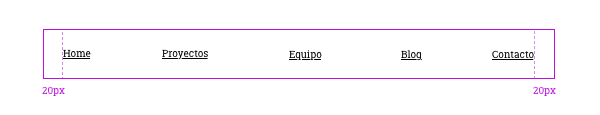

<!--
  Este archivo está escrito en Markdown
  Para obtener más info acerca de qué es Markdown:

  https://www.youtube.com/watch?v=TtSWo2nbzAk&t=199s
-->

* * *
EJERCICIO 3: JUSTIFY CONTENT y ALIGN ITEMS

1. Hacer un menú horizontal con un contenedor flex de 100px de alto
2. Las opciones de menú serán:
	* Home
	* Proyectos
	* Equipo
	* Blog
	* Contacto
3. Hacer que se distribuyan horizontalmente ocupando todo el espacio disponible, que la primera opción esté a 20px del borde izquierdo, y la última esté a 20px del borde derecho
4. Todos los textos deben aparecer centrados verticalmente en el contenedor de 100px
* * *
