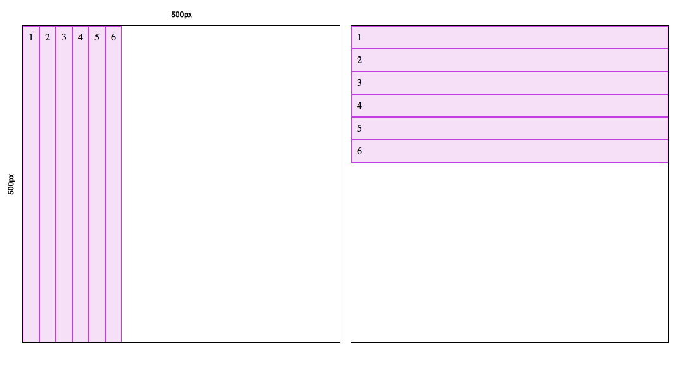

<!--
  Este archivo está escrito en Markdown
  Para obtener más info acerca de qué es Markdown:

  https://www.youtube.com/watch?v=TtSWo2nbzAk&t=199s
-->

* * *
EJERCICIO 1: FLEX y FLEX DIRECTION

1. Crear un contenedor flex de 500px por 500px y con 6 o más elementos.
2. Hacer que se distribuyan en horizontal o vertical
3. Indicar cuál es el eje principal
* * *
