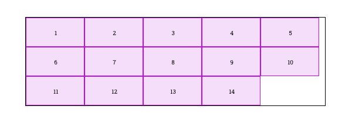

<!--
  Este archivo está escrito en Markdown
  Para obtener más info acerca de qué es Markdown:

  https://www.youtube.com/watch?v=TtSWo2nbzAk&t=199s
-->

* * *
EJERCICIO 2: FLEX WRAP

Teniendo una lista de 10 a 15 imágenes de 200x100px, hacer un bloque flexbox donde las imágenes se distribuyan por el eje horizontal y se vayan apilando uno detrás de otro.
* * *
EJERCICIO 3: JUSTIFY CONTENT y ALIGN ITEMS
