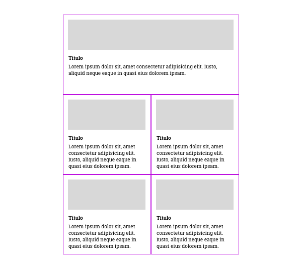

<!--
  Este archivo está escrito en Markdown
  Para obtener más info acerca de qué es Markdown:

  https://www.youtube.com/watch?v=TtSWo2nbzAk&t=199s
-->

EJERCICIO 4: ORDER

1. Hacer un listado de noticias con imagen, título y párrafo de contenido
2. Meterlas en un contenedor flex y hacer que se distribuyan a dos columnas
3. Elegir una noticia, por ejemplo, la última, y ponerla como destacada, en primer lugar y ocupando las dos columnas
* * *
