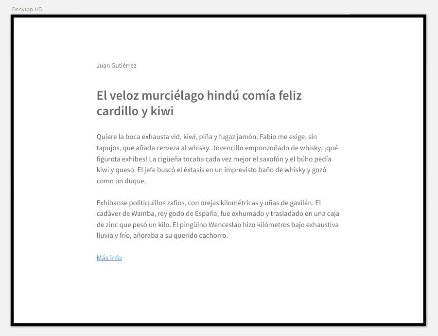

<!--
  Este archivo está escrito en Markdown
  Para obtener más info acerca de qué es Markdown:

  https://www.youtube.com/watch?v=TtSWo2nbzAk&t=199s
-->

***
EJERCICIO 10:

Crea una composición similar a la de la imagen.

Las dimensiones de esta composición serían las siguientes:
- El body tendrá un borde de 8px
- El contenido estará centrado dentro del body e irá dentro de un div que tendrá 106px de margen superior
- En el primer texto irá el nombre del autor con una fuente de 18px y un margen inferior de 40px
- El titular irá después con un tamaño de fuente de 32px y un margen inferior de 32px
- Cada párrafo tendrá un tamaño de fuente de 18px y un margen inferior de 27px
- El enlace tendrá un padding superior e inferior de 8px y otro izquierdo y derecho de 16px y un margen izquierdo de -16px
***
