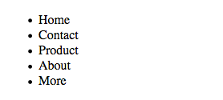
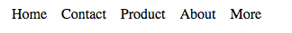

<!--
  Este archivo está escrito en Markdown
  Para obtener más info acerca de qué es Markdown:

  https://www.youtube.com/watch?v=TtSWo2nbzAk&t=199s
-->

***
EJERCICIO 8:

Crea una lista de cinco elementos que se muestre en línea y con espacios entre cada elemento de 12 píxeles.

Vista de la lista sin estilos

Vista de la lista con estilos

***
