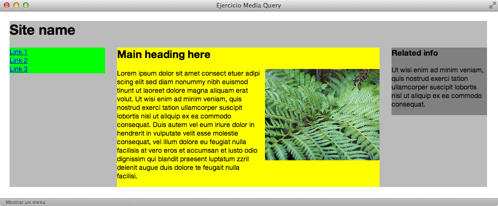
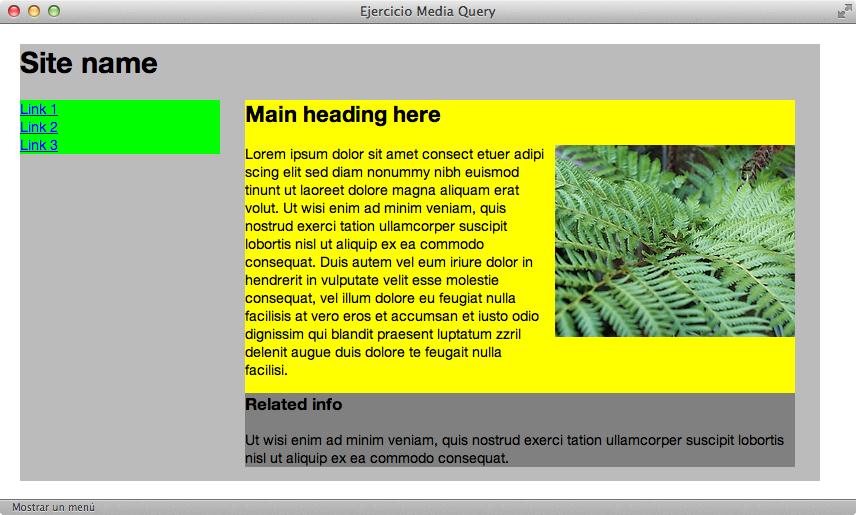
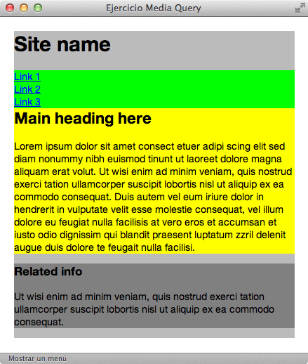

<!--
  Este archivo está escrito en Markdown
  Para obtener más info acerca de qué es Markdown:

  https://www.youtube.com/watch?v=TtSWo2nbzAk&t=199s
-->

***
EJERCICIO 9:

Dados los siguientes diseños, maquetar la web aplicando las mediaqueries necesarias.

Aspecto de la web a pantalla completa

Aspecto de la web en una pantalla de 1000px

Aspecto de la web en una pantalla de 480px

***
